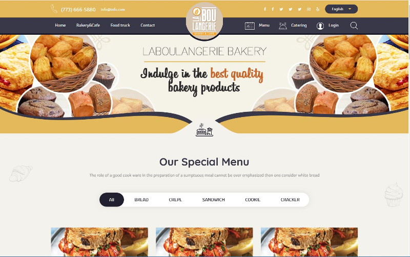
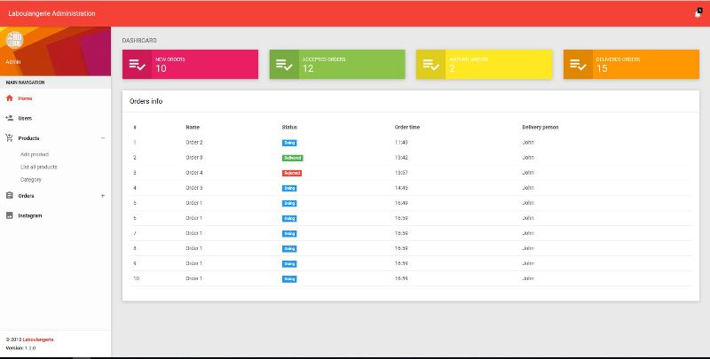

# Laboulangerie bakery

Java Web Application made with Spring Boot. Started with three other people in the BILD-IT office. Still in progress.

---

Application will cover all aspects of restaurant (chain) management: 
    - Employee management  
    - Products/offer management 
    - Supply management 
    - Customer service management 
    - Online order management
    - Social media management
    
Roles:  
    - Super admin 
    - Client 
    - Admin 
    - Office manager 
    - Office head cheaf 
    - Office waiter 
    - Office cashier 
    
---

---

### Clone

- Clone this repo to your local machine using `https://github.com/KulovacNedim/MyBakery`

---

### database 

- Import database script 'bakery.sql' from /documentation/DBconfiguration folder.  
- Don't forget to enter credentials for your database in /project/src/main/resources/application.properties
- In same file tune spring.jpa.hibernate.ddl-auto properties for generating schema utils
- In /project/src/main/java/com/bakery/configuration/DatabaseSeeder.java file edit doUpdate field to set database seeder to seed items every time or not
---

